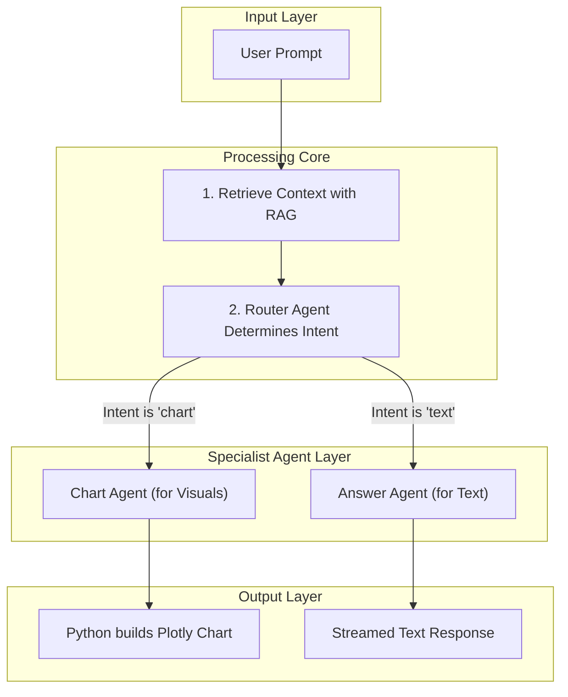

# 🪐 Kepler Financial Analyst: AI-Powered SEC Filing Analysis

**An advanced multi-agent AI system for interactive analysis and on-the-fly visualization of corporate financial documents.**

---

*Replace this with a GIF of your Streamlit App in Action!*


---
##  Live Demo 🚀

**Watch a complete video walkthrough of the application in action:**

[**Kepler Financial Analyst - Live Demo on YouTube**](https://youtu.be/9pQUymQ_7B0?si=FevXhvyDuY1VGX7L)

---

## Overview 📝

Kepler is a state-of-the-art web application that transforms the way users interact with dense financial reports like SEC 10-K filings. Moving beyond simple text search, this project leverages a sophisticated **multi-agent AI system** to provide a truly interactive analysis experience.

Users can ask complex questions in natural language, and the system can both generate precise, cited text answers and create beautiful, interactive data visualizations on the fly. The application is built on a robust, modern AI stack, showcasing an advanced understanding of Retrieval-Augmented Generation (RAG), agent-based architectures, and professional front-end development.

---

##  Key Features ✨

* **🤖 Multi-Agent System:** Employs specialist AI agents for distinct tasks (routing, data extraction, answering) to ensure high accuracy and reliability, avoiding the pitfalls of single-model systems.
* **📊 On-the-Fly Visualizations:** Translates natural language requests like *"Chart the net income over the last 3 years"* into interactive plots using Plotly, powered by an AI that understands the user's visualization intent.
* **🧠 "Natural Language to Query" Architecture:** The AI's primary role is to understand user intent and translate it into structured queries. This allows a robust Python backend (using Pandas) to handle all data processing, ensuring data accuracy and chart reliability.
* **⚡ Advanced RAG Pipeline:** Combines fast semantic search (using Qdrant) on unstructured text with structured data lookups from pre-processed financial tables for highly contextual and accurate responses.
* **💬 Interactive Chat Interface:** A polished and responsive UI built with Streamlit, featuring streaming answers, a dynamic send/stop button, and a custom "Deep Space" theme.
* **📚 Trustworthy Citations:** Every text-based answer is backed by direct quotes from the source document, providing verifiability and building user trust.

---

##  System Architecture 🏗️

The project is built on a professional multi-agent architecture where tasks are delegated to the most suitable component. This separation of concerns is the key to the application's reliability.



1.  **Retrieval-Augmented Generation (RAG):** The user's prompt is first used to retrieve the most relevant text chunks from the document using a Qdrant vector database.
2.  **Router Agent:** This specialist AI's only job is to classify the user's intent as either "text" or "chart".
3.  **Specialist Agents:** Based on the router's decision, a specialized agent is activated:
    * **Answer Agent:** Generates a detailed text response.
    * **Chart Agent:** Translates the user's request into a structured data query.
4.  **Python Backend (The Orchestrator):** The Streamlit application acts as the central controller. It receives the outputs from the AI agents and uses powerful libraries like Pandas and Plotly to process the data and render the final, reliable output.

---

##  Technology Stack 🛠️

| Technology | Description |
| :--- | :--- |
| **Python** | The core programming language for the entire application. |
| **Streamlit** | For building the beautiful and interactive web front-end. |
| **Hugging Face** | For accessing the open-source `Mistral-7B` LLM and embedding models. |
| **LangChain** | The primary framework for orchestrating the multi-agent system and RAG pipeline. |
| **PyTorch** | The deep learning framework that powers the underlying language models. |
| **Qdrant** | High-performance vector database used for efficient semantic search (RAG). |
| **Pandas** | The essential library for pre-processing financial tables and handling data. |
| **Plotly** | For creating rich, interactive, and professional data visualizations. |

---

##  Local Setup & Installation ⚙️

To run this project locally, follow these steps:

1.  **Clone the repository:**
    ```bash
    git clone [https://github.com/your-username/kepler-financial-analyst.git](https://github.com/your-username/kepler-financial-analyst.git)
    cd kepler-financial-analyst
    ```

2.  **Set up a Python environment:**
    It is highly recommended to use a virtual environment.
    ```bash
    python -m venv venv
    source venv/bin/activate  # On Windows, use `venv\Scripts\activate`
    ```

3.  **Install dependencies:**
    ```bash
    pip install -r requirements.txt
    ```

4.  **Set up environment variables:**
    You will need a Hugging Face User Access Token to download the models. Create a `.env` file in the root directory and add your token:
    ```
    HUGGING_FACE_HUB_TOKEN="your_hf_token_here"
    ```

---

##  Usage ▶️

Once the setup is complete, you can run the Streamlit application with a single command:

```bash
streamlit run app.py
```

This will start the web server, and you can access the Kepler Financial Analyst application in your browser at `http://localhost:8501`.

---

##  License 📄

This project is licensed under the MIT License. See the [LICENSE](LICENSE) file for details.
